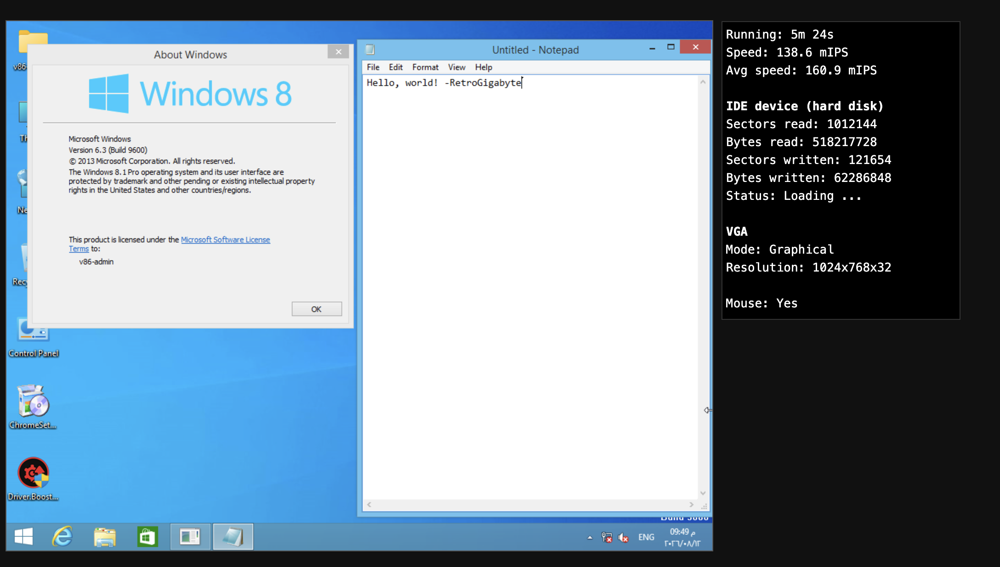

# v86 — Windows 8.1 compatible fork

All credit for the emulator itself goes to [copy/v86](https://github.com/copy/v86)
(the original v86 project by Fabian, aka "copy", and its many contributors) —
an x86 PC emulator that JIT-compiles guest machine code to WebAssembly and
runs entirely in the browser. This repo wouldn't exist without their work.

This fork builds on [DixelU/v86](https://github.com/DixelU/v86)'s `nx-support-v2`
branch, which adds NX bit (no-execute page protection) support — a hard
requirement for booting Windows 8 and newer. On top of that, this fork fixes
a crash that prevented Windows 8.1 from completing setup:

- **NX bit / PAE paging**: page directory/table entries now enforce the NX
  bit (`EFER.NXE`, CPUID leaf `0x80000001`), instead of silently ignoring it.
- **CRC32 (SSE4.2) instruction**: the `0F 38`/`0F 3A` opcode maps
  (SSSE3/SSE4.1/SSE4.2) were entirely unimplemented in upstream v86, so any
  execution of `CRC32` (`F2 0F 38 F0`/`F1`) raised an invalid-opcode fault.
  Windows 8.1 executes this during device enumeration ("Getting devices
  ready"), and the fault cascaded into a `HAL_INITIALIZATION_FAILED` (0x5C)
  bugcheck. This fork implements real CRC32-C (Castagnoli) support for the
  r8/r16/r32 source forms.
- Misc: `wasm-opt` enabled in the release build, non-fatal handling of
  unimplemented ATA commands in debug builds, and a trimmed-down start page.

With these changes, Windows 8.1 installs and boots to a working desktop.



Tested with the [Windows 8.1 Pro Lite](https://archive.org/details/win-8.1-pro-lite/)
ISO from the Internet Archive. The OS install itself was done in QEMU
(`qemu-system-x86_64`, `q35` machine, software TCG emulation); the resulting
17 GB raw disk image was then booted directly in this v86 fork, which is
what's shown above.

## Windows 10 (32-bit) — work in progress, on the `sse-work` branch

This branch adds a first batch of SSSE3/SSE4.1 instructions (`PSHUFB`,
`PABSB/W/D`, `PCMPEQQ`, the `PMINS/PMAXS`/`PMINU/PMAXU` family, `PMULLD`,
`PALIGNR`) on top of the CRC32 work above — verified correct
instruction-by-instruction against QEMU's actual reference implementation
(`target/i386/ops_sse.h`/`target/i386/tcg/emit.c.inc`), not just derived
from the spec. It also fixes a real, confirmed boot-livelock bug: I/O port
`0x70` (CMOS index/NMI-mask) had a write handler but no read handler, so
reads always returned a constant `0xFF` — Windows was polling this port in
a tight loop verifying a value it could never read back, and never made
progress. Fixed by adding a proper read handler.

That fix is real and lets Windows 10 setup progress much further than
before, but boot still hits a **second, unresolved issue**: a page fault on
a fixed virtual address in the `0xF0010000+` range that nothing ever
attempts to map — deterministic and identical across a heavily-trimmed
Windows 10 build (Tiny10) and the official Microsoft 32-bit ISO, both
fresh-installed and already-installed. The leading theory is that v86's
PIIX3/i440FX-class virtual chipset (2004-era) is missing platform features
Windows 10 assumes are present on newer q35/ICH9-class hardware (fuller
APIC/IOAPIC routing, MSI-capable interrupts) — full details, evidence, and
the suggested next steps are in [FUTURE.md](FUTURE.md).

**Windows 10 does not yet boot to a working desktop on this fork.** The
`sse-work` branch is not merged into `main` for that reason — `main`
stays at the verified-working Windows 8.1 state described above.

> **AI Disclaimer:** My changes on top of the NX bit fork (the CRC32 fix,
> the SSSE3/SSE4.1 work, and the Windows 10 investigation described above)
> were developed with the assistance of Claude AI. I believe AI-written
> code should be open source to benefit everyone and maintain transparency.

---

[](https://gitter.im/copy/v86) or #v86 on [irc.libera.chat](https://libera.chat/)

v86 emulates an x86-compatible CPU and hardware. Machine code is translated to
WebAssembly modules at runtime in order to achieve decent performance. Here's a
list of emulated hardware:

- An x86-compatible CPU. The instruction set is around Pentium 4 level,
  including full SSE3 support, NX bit (no-execute) enforcement, and the
  CRC32 (SSE4.2) instruction. Some features are missing, in particular:
  - Task gates, far calls in protected mode
  - Some 16 bit protected mode features
  - Single stepping (trap flag, debug registers)
  - Most SSSE3/SSE4.1 instructions (the `0F 38`/`0F 3A` opcode maps), other
    than CRC32
  - Some exceptions, especially floating point and SSE
  - Multicore
  - 64-bit extensions
- A floating point unit (FPU). Calculations are done using the Berkeley
  SoftFloat library and therefore should be precise (but slow). Trigonometric
  and log functions are emulated using 64-bit floats and may be less precise.
  Not all FPU exceptions are supported.
- A floppy disk controller (8272A).
- An 8042 Keyboard Controller, PS2. With mouse support.
- An 8254 Programmable Interval Timer (PIT).
- An 8259 Programmable Interrupt Controller (PIC).
- Partial APIC support.
- A CMOS Real Time Clock (RTC).
- A generic VGA card with SVGA support and Bochs VBE Extensions.
- A PCI bus. This one is partly incomplete and not used by every device.
- An IDE disk controller.
  - A built-in ISO 9660 CD-ROM generator.
- An NE2000 (RTL8390) PCI network card.
- Various virtio devices: Filesystem, network and balloon.
- A SoundBlaster 16 sound card.
- A hayes-compatible dial-up Modem.

## Demos

[9front](https://copy.sh/v86/?profile=9front) —
[Arch Linux](https://copy.sh/v86/?profile=archlinux) —
[Android-x86 1.6-r2](https://copy.sh/v86?profile=android) —
[Android-x86 4.4-r2](https://copy.sh/v86?profile=android4) —
[BasicLinux](https://copy.sh/v86/?profile=basiclinux) —
[Buildroot Linux](https://copy.sh/v86/?profile=buildroot) —
[Damn Small Linux](https://copy.sh/v86/?profile=dsl) —
[ELKS](https://copy.sh/v86/?profile=elks) —
[FreeDOS](https://copy.sh/v86/?profile=freedos) —
[FreeBSD](https://copy.sh/v86/?profile=freebsd) —
[FiwixOS](https://copy.sh/v86/?profile=fiwix) —
[Haiku](https://copy.sh/v86/?profile=haiku) —
[SkiffOS](https://copy.sh/v86/?profile=copy/skiffos) —
[ReactOS](https://copy.sh/v86/?profile=reactos) —
[Windows 2000](https://copy.sh/v86/?profile=windows2000) —
[Windows 98](https://copy.sh/v86/?profile=windows98) —
[Windows 95](https://copy.sh/v86/?profile=windows95) —
[Windows 1.01](https://copy.sh/v86/?profile=windows1) —
[MS-DOS 6.22](https://copy.sh/v86/?profile=msdos) —
[OpenBSD](https://copy.sh/v86/?profile=openbsd) —
[Oberon](https://copy.sh/v86/?profile=oberon) —
[KolibriOS](https://copy.sh/v86/?profile=kolibrios) —
[SkiftOS](https://copy.sh/v86?profile=skift) —
[QNX](https://copy.sh/v86/?profile=qnx)

## Documentation

[How it works](docs/how-it-works.md) —
[Networking](docs/networking.md) —
[Dial-up modem networking](docs/modem.md) —
[Alpine Linux guest setup](tools/docker/alpine/) —
[Arch Linux guest setup](docs/archlinux.md) —
[Windows NT guest setup](docs/windows-nt.md) —
[Windows 9x guest setup](docs/windows-9x.md) —
[9p filesystem](docs/filesystem.md) —
[Linux rootfs on 9p](docs/linux-9p-image.md) —
[Profiling](docs/profiling.md) —
[CPU Idling](docs/cpu-idling.md)

## Compatibility

Here's an overview of the operating systems supported in v86:

- Linux works pretty well. 64-bit kernels are not supported.
  - [Buildroot](https://buildroot.org/) can be used to build a minimal image.
    [humphd/browser-vm](https://github.com/humphd/browser-vm) and
    [darin755/browser-buildroot](https://github.com/Darin755/browser-buildroot) have some useful scripts for building one.
  - [SkiffOS](https://github.com/skiffos/SkiffOS/tree/master/configs/browser/v86) (based on Buildroot) can cross-compile a custom image.
  - Ubuntu and other Debian derivatives works up to the latest version that supported i386 (16.04 LTS or 18.04 LTS for some variants).
  - Alpine Linux works. An image can be built from a Dockerfile, see [tools/docker/alpine/](tools/docker/alpine/).
  - Arch Linux 32 works. See [archlinux.md](docs/archlinux.md) for building an image.
- ReactOS works.
- FreeDOS, Windows 1.01 and MS-DOS run very well.
- KolibriOS works.
- Haiku works.
- Android-x86 has been tested up to 4.4-r2.
- Windows 1, 3.x, 95, 98, ME, NT and 2000 work reasonably well.
  - In Windows 2000 and higher the PC type has to be changed from ACPI PC to Standard PC
  - There are some known boot issues ([#250](https://github.com/copy/v86/issues/250), [#433](https://github.com/copy/v86/issues/433), [#507](https://github.com/copy/v86/issues/507), [#555](https://github.com/copy/v86/issues/555), [#620](https://github.com/copy/v86/issues/620), [#645](https://github.com/copy/v86/issues/645))
  - See [Windows 9x guest setup](docs/windows-9x.md)
- Windows XP, Vista and 8 work under certain conditions (see [#86](https://github.com/copy/v86/issues/86), [#208](https://github.com/copy/v86/issues/208))
  - See [Windows NT guest setup](docs/windows-nt.md)
- Many hobby operating systems work.
- 9front works.
- Plan 9 doesn't work.
- QNX works.
- OS/2 doesn't work.
- FreeBSD works.
- OpenBSD works with a specific boot configuration. At the `boot>` prompt type
  `boot -c`, then at the `UKC>` prompt `disable mpbios` and `exit`.
- NetBSD works only with a custom kernel, see [#350](https://github.com/copy/v86/issues/350).
- SerenityOS works (only 32-bit versions).
- [SkiftOS](https://skiftos.org/) works.

You can get some information on the disk images here: https://github.com/copy/images.

## How to build, run and embed?

You need:

- make
- Rust with the wasm32-unknown-unknown target
- A version of clang compatible with Rust
- java (for Closure Compiler, not necessary when using `debug.html`)
- nodejs (a recent version is required, v16.11.1 is known to be working)
- To run tests: nasm, gdb, qemu-system, gcc, libc-i386 and rustfmt

See [tools/docker/test-image/Dockerfile](tools/docker/test-image/Dockerfile)
for a full setup on Debian or
[WSL](https://docs.microsoft.com/en-us/windows/wsl/install).

- Run `make` to build the debug build (at `debug.html`).
- Run `make all` to build the optimized build (at `index.html`).
- ROM and disk images are loaded via XHR, so if you want to try out `index.html`
  locally, make sure to serve it from a local webserver. You can use `make run`
  to serve the files using Python's http module.
- If you only want to embed v86 in a webpage you can use `libv86.js`. For usage,
  check out the [examples](examples/). You can download it from the [release section](https://github.com/copy/v86/releases).
- For bundler-based setups (Vite/React/Next/Webpack), there is also an official npm package:
https://www.npmjs.com/package/v86

  This package was originally maintained by [@giulioz](https://github.com/giulioz) (bundler-optimized fork) and was made "official" for this repo by [@basicer](https://github.com/basicer) with the author's permission.
  It is published automatically from this repository via GitHub Actions ([.github/workflows/ci.yml](.github/workflows/ci.yml), Upload release job) on pushes to `master` and uses `npm publish --provenance`.
  
  Install: `npm install v86`

### Alternatively, to build using Docker

- If you have Docker installed, you can run the whole system inside a container.
- See `tools/docker/exec` to find the Dockerfile required for this.
- You can run `docker build -f tools/docker/exec/Dockerfile -t v86:alpine-3.19 .` from the root directory to generate docker image.
- Then you can simply run `docker run -it -p 8000:8000 v86:alpine-3.19` to start the server.
- Check `localhost:8000` for hosted server.

### Running via Dev Container

- If you are using an IDE that supports Dev Containers, such as GitHub Codespaces, the Visual Studio Code Remote Container extension, or possibly others such as Jetbrains' IntelliJ IDEA, you can setup the development environment in a Dev Container.
- Follow the instructions from your development environment to setup the container.
- Run the Task "Fetch images" in order to download images for testing.

## Testing

The disk images for testing are not included in this repository. You can
download them directly from the website using:

`curl --compressed --output-dir images/ --remote-name-all https://i.copy.sh/{linux.iso,linux3.iso,linux4.iso,buildroot-bzimage68.bin,TinyCore-11.0.iso,oberon.img,msdos.img,openbsd-floppy.img,kolibri.img,windows101.img,os8.img,freedos722.img,mobius-fd-release5.img,msdos622.img}`

Run integration tests: `make tests`

Run all tests: `make jshint rustfmt kvm-unit-test nasmtests nasmtests-force-jit expect-tests jitpagingtests qemutests rust-test tests`

See [tests/Readme.md](tests/Readme.md) for more information.

## API examples

- [Basic](examples/basic.html)
- [Programatically using the serial terminal](examples/serial.html)
- [A Lua interpreter](examples/lua.html)
- [Two instances in one window](examples/two_instances.html)
- [Networking between browser windows/tabs using the Broadcast Channel API](examples/broadcast-network.html)
- [TCP Terminal (fetch-based networking)](examples/tcp_terminal.html)
- [Saving and restoring emulator state](examples/save_restore.html)

Using v86 for your own purposes is as easy as:

```javascript
var emulator = new V86({
    screen_container: document.getElementById("screen_container"),
    bios: {
        url: "../../bios/seabios.bin",
    },
    vga_bios: {
        url: "../../bios/vgabios.bin",
    },
    cdrom: {
        url: "../../images/linux.iso",
    },
    autostart: true,
});
```

See [v86.d.ts](v86.d.ts) for TypeScript definitions. You can use `make doc` (TypeDoc) or `make denodoc` (Deno) to generate HTML documentation in `./docs/api/`.

## License

v86 is distributed under the terms of the Simplified BSD License, see
[LICENSE](LICENSE). The following third-party dependencies are included in the
repository under their own licenses:

- [`lib/softfloat/softfloat.c`](lib/softfloat/softfloat.c)
- [`lib/zstd/zstddeclib.c`](lib/zstd/zstddeclib.c)
- [`tests/kvm-unit-tests/`](tests/kvm-unit-tests)
- [`tests/qemutests/`](tests/qemutests)
- [`src/floppy.js/`](src/floppy.js) contains parts ported from qemu under the MIT license, see LICENSE.MIT.

## Credits

- CPU test cases via [QEMU](https://wiki.qemu.org/Main_Page)
- More tests via [kvm-unit-tests](https://www.linux-kvm.org/page/KVM-unit-tests)
- [zstd](https://github.com/facebook/zstd) support is included for better compression of state images
- [Berkeley SoftFloat](http://www.jhauser.us/arithmetic/SoftFloat.html) is included to precisely emulate 80-bit floating point numbers
- [The jor1k project](https://github.com/s-macke/jor1k) for 9p, filesystem and uart drivers
- [WinWorld](https://winworldpc.com/) sources of some old operating systems
- [OS/2 Museum](https://www.os2museum.com/) sources of some old operating systems
- [ArchiveOS](https://archiveos.org/) sources of several operating systems

## More questions?

Shoot me an email to `copy@copy.sh`. Please report bugs on GitHub.
